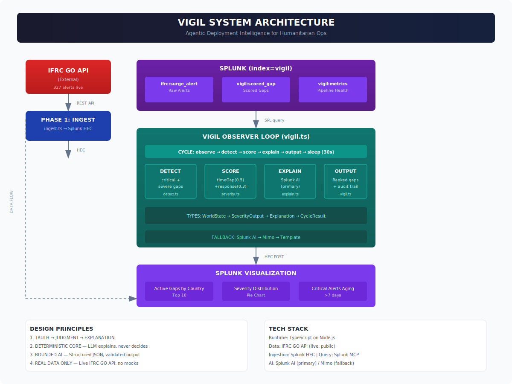

# Vigil

**Agentic deployment intelligence for humanitarian surge operations.**

[](https://splunk.devpost.com/)
[](https://opensource.org/licenses/MIT)

Vigil continuously monitors humanitarian response systems, detects when alerts go unfulfilled, quantifies operational risk, and explains the systemic causes behind those gaps — all using live IFRC GO data inside Splunk.

## The Problem

The IFRC GO platform has documented **327 surge alerts raised** against only **35 deployments actually fulfilled**. Humanitarian response systems generate alerts, but they don't reason about whether those alerts are being fulfilled.

**Vigil watches that gap.**

## Architecture



See [ARCHITECTURE.md](./ARCHITECTURE.md) for the full text-based architecture diagram.

```
IFRC GO API → Splunk HEC → Observer Loop → Splunk Dashboard
                         ↓
              observe → detect → score → explain → output
```

**Core principles:**
- **Truth / Judgment / Explanation** — Each phase has a single responsibility
- **Deterministic core** — LLM explains, never decides
- **Real data only** — No mocks, no synthetic data
- **Bounded AI** — LLM input/output validated with upper bounds
- **Full audit trail** — Every decision traceable and explainable

## What It Does

1. **Ingests** real IFRC GO surge alerts into Splunk via HEC
2. **Correlates** alerts to detect unresolved humanitarian gaps
3. **Scores** severity using deterministic intelligence (time gap, response missing, event pressure)
4. **Explains** causal factors using Splunk AI / LLM (explains, never decides)
5. **Outputs** ranked, actionable humanitarian insights with full audit trail

## Tech Stack

- **Runtime:** TypeScript on Node.js
- **Data Source:** [IFRC GO API](https://goadmin.ifrc.org/api/v2/surge_alert/) (live, public)
- **Ingestion:** Splunk HEC (HTTP Event Collector)
- **Query Layer:** Splunk REST API / MCP Server
- **AI Layer:** Splunk AI (primary) / Mimo (fallback) — adapter pattern
- **Packaging:** Splunk App (.spl) with AppInspect validation
- **Testing:** Node.js built-in test runner (27 tests)

## Quick Start

```bash
# Install dependencies
npm install

# Run tests
npm test

# Type check
npm run check

# Single ingestion cycle
npm run ingest:once

# Start observer loop (30s cycles)
npm run vigil
```

## Environment Variables

Copy `.env.example` to `.env` and configure:

```bash
# Splunk HEC (for ingestion)
SPLUNK_HEC_URL=https://your-splunk:8088/services/collector
SPLUNK_HEC_TOKEN=your-hec-token

# Splunk API (for queries)
SPLUNK_BASE_URL=https://your-splunk:8089
SPLUNK_USERNAME=your-username
SPLUNK_PASSWORD=your-password

# IFRC GO API
IFRC_API_URL=https://goadmin.ifrc.org/api/v2/surge_alert/

# LLM (Mimo fallback)
MIMO_BASE_URL=https://api.xiaomimimo.com/v1
MIMO_MODEL=mimo-v2.5
MIMO_API_KEY=your-mimo-key

# Observer Loop
VIGIL_INTERVAL_MS=30000

# Explanation Batching
EXPLAIN_BATCH_SIZE=3
```

## Project Structure

```
src/
├── modules/
│   ├── ifrc/         # IFRC GO API service
│   └── splunk/       # Splunk HEC + query service
├── detect.ts         # Gap identification (Phase 2)
├── severity.ts       # Deterministic scoring model (Phase 3)
├── explain.ts        # Causal explanation with LLM adapter (Phase 4)
├── vigil.ts          # Observer loop + HEC output (Phase 5)
├── ingest.ts         # One-shot ingestion (Phase 1)
├── types.ts          # Shared types
└── main.ts           # Entry point

splunk-app/vigil/     # Installable Splunk app
├── default/
│   ├── app.conf
│   ├── savedsearches.conf
│   └── data/ui/views/vigil_dashboard.xml
├── metadata/default.meta
└── README/README.txt

tests/                # 27 unit tests
```

## How It Works

### The Intelligence Loop

```
┌─────────────────────────────────────────────────────────┐
│  CYCLE (every 30s)                                      │
│                                                         │
│  1. OBSERVE   → Query Splunk for current state          │
│  2. DETECT    → Filter critical/severe gaps             │
│  3. SCORE     → Compute severity (deterministic)        │
│  4. EXPLAIN   → Generate causal explanation (LLM)       │
│  5. OUTPUT    → Ranked gaps + audit trail               │
│                                                         │
│  Post scored gaps to Splunk via HEC                     │
│  Sleep 30s → repeat                                     │
└─────────────────────────────────────────────────────────┘
```

### Severity Scoring

```
severity = (timeGapScore × 0.5) + (responseRequiredScore × 0.3) + (eventPressureScore × 0.2)
```

| Sub-Score | Input | Logic |
|-----------|-------|-------|
| timeGapScore | hours_open | <24h → 0.2, <72h → 0.6, <168h → 0.85, ≥168h → 1.0 |
| responseRequiredScore | deployment_needed | true → 1.0, false → 0.2 |
| eventPressureScore | alert_count_24h | >20 → 1.0, >10 → 0.7, ≤10 → 0.4 |

| Score | Level |
|-------|-------|
| 0.00–0.39 | LOW |
| 0.40–0.59 | MEDIUM |
| 0.60–0.79 | HIGH |
| 0.80–1.00 | CRITICAL |

### Explanation Guardrails

- **Bounded input** — LLM receives only structured JSON
- **Upper bounds** — Summary <200, cause/impact <300, action <200 chars
- **Batched concurrency** — Max 3 concurrent LLM calls
- **Adapter pattern** — Splunk AI primary, Gemini fallback
- **Fallback on failure** — Returns safe defaults, never crashes

## Splunk App

Vigil ships as an installable Splunk app with:

- **Dashboard:** 8 panels showing gaps, severity, and pipeline health
- **Saved Searches:** 8 pre-built queries
- **Index:** `index=vigil` (dedicated)
- **Sourcetypes:** `ifrc:surge_alert`, `vigil:scored_gap`, `vigil:metrics`

### Install

1. Create `index=vigil` in Splunk
2. Install `vigil.spl` via Splunk Web
3. Access dashboard: Splunk Web → Vigil → Humanitarian Gap Monitor

## Data Source

Vigil uses the live [IFRC GO API](https://goadmin.ifrc.org/api/v2/surge_alert/) — the same data the International Federation of Red Cross uses for real humanitarian operations. Every data point is verifiable by calling the API directly.

## License

MIT

## Acknowledgments

Built for the [Splunk Agentic Ops Hackathon](https://splunk.devpost.com/) — Observability track.
